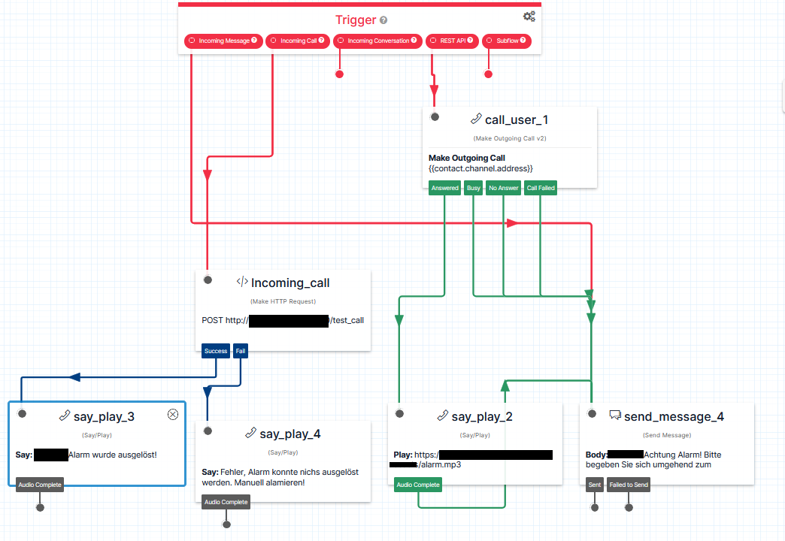

# Twilio_AlarmServer

# 📞 Twilio Alarmserver 
Notrufsystem für kleine und mittelständische Unternehmen

## 🔔 Projektbeschreibung

Ein schlanker, kostengünstiger Alarmserver für kleine und mittelständische Unternehmen, Vereine oder Organisationen.
Ermöglicht automatisierte Notrufe per Anruf und SMS an vordefinierte Kontakte – ausgelöst durch einen Anruf bei Twilio oder eine API-Anfrage. Ideal für schnelle Benachrichtigungen bei Notfällen, Störungen oder Evakuierungen – ohne teure Infrastruktur oder komplexe Systeme.

Die Umsetzung erfolgt mit [Twilio](https://www.twilio.com/), einem Cloud-Kommunikationsdienstleister, über den sowohl Sprachanrufe als auch SMS realisiert werden.

---

## ✅ Funktionen

- Reaktion auf eingehende Anrufe bei Twilio (automatischer Alarmversand)
- Manuelles Auslösen des Alarms per API (HTTP POST)
- API meldet wieder an an Twilio
- Versand von Alarmmeldungen per Anruf und SMS an mehrere Personen gleichzeitig
- Trennung von Kontakten (in einer Textdatei) und Code (Best Practice)


---

## 🗃️ Twilio Flow (Sample)

 "Twilio Flow Sample"


---

## 🚀 Projekt starten

### Voraussetzungen

- Python 3.x
- Twilio-Konto mit aktivierter Telefonnummer
- Server mit Port 8830 (Firewallreglen beachten)

### 🖥️ Installation

```bash
git clone https://github.com/Twilio_AlarmServer/twilio-alarmserver.git
cd twilio-alarmserver
pip install -r requirements.txt


---

## 📞 Twilio Dokumentation

- [Twilio Studio Flow](https://www.twilio.com/docs/studio/)
